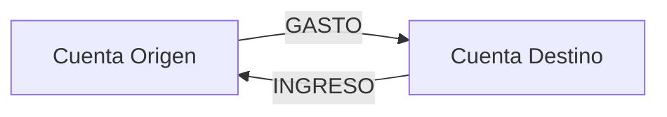

# Lógica de Cálculo para Transacciones

## Ubicación Principal: `core/models.py` (Método `save()` de `Transaccion`)

```python:core/models.py
def save(self, *args, **kwargs):
    if not self.ajuste:
        naturaleza = self.medio_pago.naturaleza if self.medio_pago else None
        
        if self.tipo == TransaccionTipo.INGRESO:
            if naturaleza == "DEUDORA":
                # Activo: entrada de dinero → CARGO (positivo)
                self.monto = abs(self.monto)
            else:  # Acreedora
                # Pasivo: aumento de deuda → CARGO (positivo)
                self.monto = abs(self.monto)
        
        elif self.tipo == TransaccionTipo.GASTO:
            if naturaleza == "DEUDORA":
                # Activo: salida de dinero → ABONO (negativo)
                self.monto = -abs(self.monto)
            else:  # Acreedora
                # Pasivo: disminución de deuda → ABONO (negativo)
                self.monto = -abs(self.monto)
    
    super().save(*args, **kwargs)
```

## Matriz de Comportamiento

### 1. Transacciones de INGRESO
| Naturaleza Cuenta | Efecto               | Signo Monto | Ejemplo                  |
|-------------------|----------------------|-------------|--------------------------|
| **Deudora**       | Aumenta activo       | Positivo (+) | Depósito en cuenta bancaria |
| **Acreedora**     | Aumenta pasivo       | Positivo (+) | Nuevo préstamo recibido    |

### 2. Transacciones de GASTO
| Naturaleza Cuenta | Efecto               | Signo Monto | Ejemplo                  |
|-------------------|----------------------|-------------|--------------------------|
| **Deudora**       | Disminuye activo     | Negativo (-) | Pago de servicio         |
| **Acreedora**     | Disminuye pasivo     | Negativo (-) | Pago de deuda            |

### 3. Transacciones de TRANSFERENCIA INTERNA
Cada transferencia se compone de 2 transacciones vinculadas:



**Lógica para cuenta ORIGEN (siempre es GASTO):**
```python
# Para cuenta origen (siempre GASTO)
if origen.naturaleza == "DEUDORA":
    monto = -abs(monto)  # Activo: salida
else:  # Acreedora
    monto = -abs(monto)  # Pasivo: disminución deuda
```

**Lógica para cuenta DESTINO (siempre es INGRESO):**
```python
# Para cuenta destino (siempre INGRESO)
if destino.naturaleza == "DEUDORA":
    monto = abs(monto)   # Activo: entrada
else:  # Acreedora
    monto = abs(monto)   # Pasivo: aumento deuda
```

## Flujo Completo de Cálculos

### 1. Cuando se crea/edita una transacción
- Se activa el método `save()` del modelo `Transaccion`
- Se determina el tipo de transacción (INGRESO/GASTO/TRANSFERENCIA)
- Se obtiene la naturaleza de la cuenta de pago (`medio_pago`)
- Se aplica la lógica de signos según la matriz anterior
- Se guarda en la base de datos

### 2. Cuando se consulta un saldo
```python:core/models.py
def saldo(self):
    return self.transacciones_pago.aggregate(
        total=models.Sum("monto")
    )["total"] or Decimal("0.00")
```

### 3. En la vista de detalle de cuenta
```python:core/views.py
# En CuentaDetailView.get_context_data()
for movimiento in page_obj:
    if cuenta.naturaleza == "DEUDORA":
        movimiento.es_cargo = movimiento.monto > 0
    else:  # Acreedora
        movimiento.es_cargo = movimiento.monto < 0
    
    # Cálculo de saldo parcial
    saldo_inicial += movimiento.monto
    movimiento.saldo_parcial = saldo_inicial
```

## Ejemplos Reales

### Caso 1: Depósito en cuenta de débito (Deudora)
- **Tipo:** INGRESO
- **Naturaleza:** Deudora
- **Monto calculado:** +$1000.00
- **Efecto:** Aumenta saldo

### Caso 2: Pago de tarjeta de crédito (Acreedora)
- **Tipo:** GASTO
- **Naturaleza:** Acreedora
- **Monto calculado:** -$500.00
- **Efecto:** Disminuye deuda

### Caso 3: Transferencia entre cuentas
1. **Cuenta Origen (Deudora):**
   - Tipo: GASTO
   - Monto: -$300.00
   - Efecto: Disminuye saldo

2. **Cuenta Destino (Acreedora):**
   - Tipo: INGRESO
   - Monto: +$300.00
   - Efecto: Aumenta deuda

## Archivos Clave
1. `core/models.py`: Lógica central de cálculo
2. `core/views.py`: Visualización de movimientos
3. `templates/cuentas/cuenta_detail.html`: Presentación de datos
4. `templates/transacciones/transacciones_form.html`: Formulario de creación

## Resumen de Principios
1. **Cuentas Deudoras (Activos):**
   - INGRESO = Aumento = Positivo
   - GASTO = Disminución = Negativo

2. **Cuentas Acreedoras (Pasivos):**
   - INGRESO = Aumento deuda = Positivo
   - GASTO = Disminución deuda = Negativo

3. **Transferencias:**
   - Siempre involucran un GASTO (origen) y un INGRESO (destino)
   - Los signos se determinan por la naturaleza de cada cuenta


sta lógica garantiza que:
Los principios contables se respetan en todos los casos
Los cálculos de saldos son consistentes
La visualización refleja correctamente la naturaleza de cada movimiento
El sistema maneja coherentemente todos los tipos de transacciones

